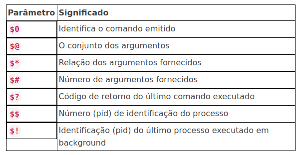

## Guia de comandos Shell
[Leia mais](https://www.uniaogeek.com.br/guia-de-comandos-shell-terminal-gnulinux/)

## Comandos mais utilizados
[Leia Mais](https://www.tutorialspoint.com/unix/unix-useful-commands.htm)

## Tratando argumentos

## Selecionando interpretador de comandos carregado no momento do login
`#!/bin/bash`
